# Аудит перед редизайном (шаг 1)

«Дизайнер», 2026-09-26. Бриф — `docs/roles/designer.md`. Кода сайта этот
шаг не меняет: только осмотр, цифры и два варианта направления на
согласование (шаг 2).

**Как снято.** Локальная сборка `main` (`26d26f0`) на своей базе с
сидом (76 мест). Playwright/Chromium, 390×844 и 1280×800, `/sk/` и
`/en/`, 14 типов страниц из §1 брифа: главная, категория в городе, в
районе, признак (nonstop), цены категории, цена услуги, карточка места
(полная — BAJVET, и почти пустая — ERPOL), город, салоны, help,
«добавить место», юридическая, 404. Всего 50 снимков + открытые
диалоги (поиск). Картинки в этом файле — `docs/design/audit/`.

Карта Google в карточке места в песочнице не грузится (нет сети) —
пустой блок на снимках это не баг сайта.

---

## Коротко

1. **Главная — лендинг, а не справочник.** На первом экране телефона —
   мастер поиска из трёх шагов; ни одного места, телефона или цены.
   Дальше — блок статистики, «01/02/03», квиз, советы, большой
   оранжевый баннер. Это и есть основной «ИИ-вайб».
2. **До первого места в списке — 1,3 экрана фильтров.** Фильтры на
   телефоне занимают не 3 строки, а ~12 (категории, животные, признаки,
   рейтинг, сортировка). Первая кнопка «Zavolať» — на 1304 px.
3. **Карточка в списке не говорит, открыто ли место.** «Otvorené teraz»
   есть только как фильтр; в самой карточке нет ни статуса, ни часов на
   сегодня. Зато три одинаково крупные кнопки в две строки.
4. **Слишком много цвета и декора:** 27 цветов текста и 23 цвета фона
   на одной главной, 6 цветов категорий + оранжевый + синий + navy +
   зелёный + янтарный, размытые пятна, точечная сетка, тени и «таблетки»
   везде.
5. **Главная кнопка «Zavolať» не проходит контраст:** белый на
   `#FF6B35` — 2,84:1 (нужно 4,5:1). Зелёные метки цены — 3,07:1.
6. **Структура хорошая и остаётся:** URL, H1, тексты-ответы, JSON-LD,
   цены с медианой, «данные с датой и источником». Редизайн — это
   токены, вёрстка компонентов и тексты интерфейса, без логики.

Предложение — два варианта (A «Чистый справочник», B «Городской гид»),
общие для обоих структурные изменения и план PR — ниже. **Моя
рекомендация — B.**

---

## 1. Цифры (телефон 390 px, если не сказано иное)

| Что | Сейчас |
|---|---|
| Первое место на странице категории | 1123 px от верха (1,3 экрана) |
| Первая кнопка «Zavolať» на странице категории | 1304 px |
| Страница «Veterinár nonstop» — 2 места | первое на 1149 px |
| Высота карточки места в списке | ~290 px → 2,5 места на экран |
| Карточка места: кнопка «Zavolať» | ~840 px — обрезана краем экрана 844 px |
| Главная: места, телефоны, цены на первом экране | 0 |
| Главная: разных цветов текста / фона | 27 / 23 (десктоп 29 / 26) |
| Главная: разных радиусов скругления | 9 (десктоп 11) |
| Страница города | 25 237 px ≈ 30 экранов (76 карточек подряд) |
| HTML страницы города / категории | 855 КБ / 420 КБ (без сжатия) |
| Интерактивных элементов ниже 32 px на карточке места | 39 |
| Контраст: белый на `#FF6B35` (кнопки «Zavolať», «Hľadať») | 2,84:1 — не AA |
| Контраст: `#06A77D` на белом («o 10 % pod trhom», €€) | 3,07:1 — не AA для мелкого текста |
| Контраст: eyebrow `#E8541F` 12 px на белом | 3,67:1 — не AA |
| Горизонтальный скролл на 390 px | нет, нигде ✓ |
| H1 на странице | ровно один везде ✓ |

---

## 2. Что выглядит «ИИ-шно»

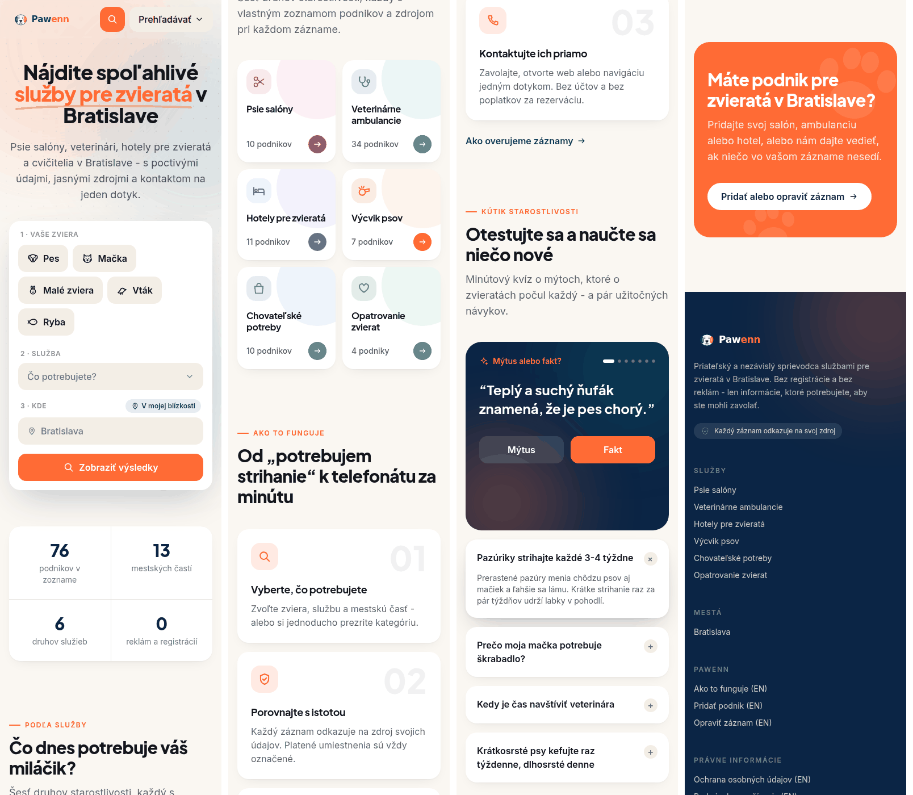

1. **Декор без информации.** Размытые пятна `AmbientBackground` на
   главной и в карточке места, точечная сетка на фоне, градиентное
   «свечение» в футере, анимации `.rise-in` и `.float-y`.
2. **Hero главной.** Оранжевые слова, подчёркнутые «волной»
   («služby pre zvieratá»); на десктопе — наклонённые «парящие» чипы
   категорий вокруг тёмной плашки «76». **Баг:** на 1280 px два чипа
   («Veterinárne ambulancie», «Výcvik psov») обрезаны правым краем
   экрана.

   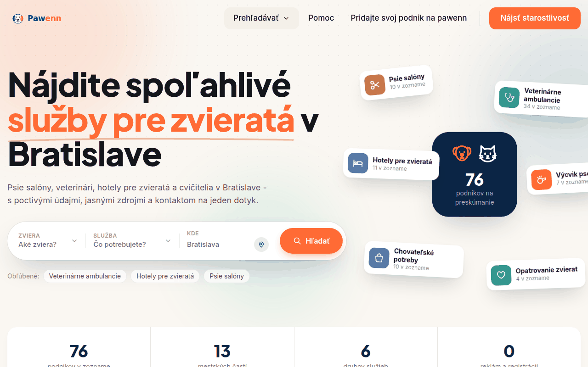
3. **Блок статистики** «76 podnikov · 13 mestských častí · 6 druhov
   služieb · 0 reklám a registrácií» — классика шаблонного лендинга.
4. **Eyebrow с чёрточкой перед каждым разделом:** «— PODĽA SLUŽBY»,
   «— AKO TO FUNGUJE», «— KÚTIK STAROSTLIVOSTI», «— PRESKÚMAJTE ĎALEJ».
5. **«Ako to funguje» 01 / 02 / 03** с огромными бледными цифрами.
6. **Квиз «Mýtus alebo fakt?»** + «Otestujte sa a naučte sa niečo
   nové» + аккордеон советов — к задаче «найти и позвонить» не
   относятся.
7. **Плитки категорий** с цветным пятном в углу и цветным кружком со
   стрелкой — у каждой категории свой цвет, на одном экране их шесть.
8. **Всё одного веса:** белые карточки с радиусом 20 px и тенью,
   «таблетки» у фильтров, кнопок, бейджей, счётчиков. Глазу не за что
   зацепиться, иерархия держится на цвете и рамках.
9. **Иконка категории в углу каждого аватара** — на странице категории
   у всех одна и та же, информации ноль.
10. **Интонация текстов:** «Nájdite spoľahlivé služby…», «Čo dnes
    potrebuje váš miláčik?», «Od „potrebujem strihanie" k telefonátu za
    minútu», «Priateľský a nezávislý sprievodca», «S láskou k zvieratám
    v Bratislave». Обещания вместо фактов.
11. **Дублирующиеся призывы:** большой оранжевый баннер с лапками
    «Máte podnik…?» на главной и тёмная плашка «Poznáte podnik, ktorý tu
    chýba?» на каждом списке — при том что та же ссылка есть в футере.
12. **Шрифт заголовков Plus Jakarta Sans 800 с плотным трекингом** —
    самый узнаваемый «стартап-лендинг» голос.
13. 404 «Stopa sa stratila» с лапой вместо «0» — мило и безвредно;
    оставить по смыслу, упростить по виду.

---

## 3. Что мешает «найти и позвонить»

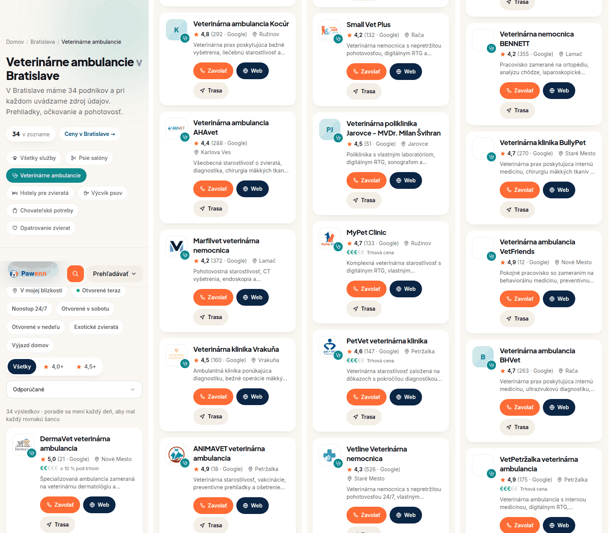

1. **Фильтры.** Над списком: счётчик + «Ceny v Bratislave», 7 кнопок
   категорий (дублируют меню), «Všetky zvieratá», 7 признаков, рейтинг
   (Všetky / 4,0+ / 4,5+), сортировка, строка про ротацию. ~800 px до
   первого места. Известная проблема №1 из брифа — на деле она больше.
2. **Нет статуса в карточке списка.** Главное преимущество («открыто
   сейчас», часы) видно только на странице места. В списке — описание
   в две строки, обрезанное «…».
3. **Три равные кнопки** (Zavolať / Web / Trasa) переносятся на две
   строки и делают карточку в два раза выше нужного.
4. **Цены почти не видны.** Ссылка на страницы цен — маленькая
   «таблетка» рядом со счётчиком (известная проблема №2). На
   страницах-признаках её тоже легко не заметить.
5. **Первый экран карточки места:** хлебные крошки в две строки, логотип
   80 px, надпись категории, название, адрес — а «Zavolať» уходит за
   край. Блок «Kontakt» повторяет адрес второй раз; телефон, сайт и
   адрес показаны и строками с иконками, и кнопками.

   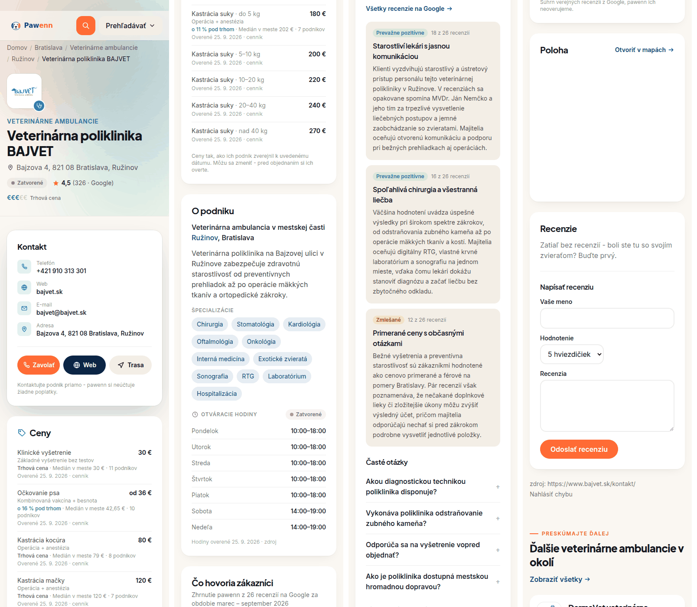
6. **Пустой блок отзывов на всех 76 местах:** «Zatiaľ bez recenzií —
   buďte prvý» + форма (имя, оценка, текст). Противоречит правилу «нет
   данных — нет блока» и тексту на Help («No unverified reviews… we
   deliberately omit open star ratings»). → вопрос владельцу, §7.
7. **Встроенная карта Google на каждой карточке:** сотни КБ скриптов на
   телефоне (бюджет LCP), и Google ставит свои cookies — а политика
   говорит «единственная cookie — `pawenn_lang`». → вопрос владельцу,
   §7.
8. **Страница города** — все 76 мест одной лентой на 30 экранов, без
   группировки по категориям; HTML 855 КБ.
9. **Поиск** (оранжевая лупа в шапке) — мастер из трёх шагов, первый —
   выбор животного (Pes / Mačka / Malé zviera / Vták / Ryba). Для
   «ветеринар рядом» это лишний шаг перед главным вопросом «что нужно».
10. **Десктоп** — список в одну колонку ~900 px, справа только плашка
    «Poznáte podnik…». Не ломается, но пусто; вторично по брифу.
11. **Мелкие цели касания:** ссылки «zdroj», «cenník», хлебные крошки,
    «Nahlásiť chybu» — ниже 32 px.

### Заметил попутно (не дизайн — передаю, сам не трогаю)

Страница `/en/how-it-works/` (текст из `docs/`, не словари):

- на проде видна плашка «DRAFT. Contact/legal details still
  placeholders — see docs/legal/»;
- в тексте сырой шаблон `"Verified: {date}" badge`;
- «No unverified reviews… we deliberately omit open star ratings» — а
  на сайте рейтинг Google и форма отзыва;
- «privacy-preserving analytics like Plausible / Umami» — а в коде
  `@vercel/analytics`;
- `contact@pawenn.com (placeholder)`.

Это юридически значимые тексты — решает владелец (или «левая рука» по
его поручению).

---

## 4. Общее для обоих вариантов (структура)

Эти изменения не зависят от выбора A/B; делаю так, если не возразите.

**Убрать:** `AmbientBackground`, точечную сетку, градиент футера,
`.float-y`/парящие чипы, блок статистики, eyebrow-подписи, «01/02/03»,
квиз и аккордеон советов с главной, оранжевый баннер с лапками (ссылка
остаётся в футере и в конце списков одной строкой), иконку-бейдж на
аватаре, цвета категорий (категорию различает название и одна
монохромная иконка).

**Главная = хаб**, всё из данных:
- заголовок + одна строка о том, что здесь есть (без обещаний);
- поле поиска — открывает существующий диалог поиска (логика та же);
- «Práve teraz»: ссылки на уже существующие страницы-признаки (otvorené
  teraz, nonstop, v nedeľu) — это самые частые «срочные» запросы;
- список категорий строками с числом мест;
- блок «Koľko to stojí» — медианы из страниц цен, ссылка «Všetky ceny».

**Список (категория, район, признак):**
- одна строка фильтров: кнопка «Filtre» (всё остальное — в нижнем
  листе) + признаки в прокручиваемой строке; категории из фильтров
  убираются (они в меню и крошках);
- блок цен категории — заметный, в самом списке (известная проблема
  №2);
- строка места: логотип / инициалы, название, **статус «Otvorené do
  18:00» / «Zatvorené · otvára v pi 8:00»**, район, рейтинг Google,
  ценовой уровень €–€€€€€ с подписью, кнопка «Zavolať»;
- описание из карточки списка убирается (оно на странице места).

**Карточка места, первый экран:** название, категория · район, статус
+ часы сегодня, рейтинг, цена, адрес → большая «Zavolať +421 …», под
ней «Trasa» и «Web» → **сразу Ceny** (решение владельца: цены после
контактов) → Otváracie hodiny → O podniku → сводка отзывов → FAQ →
похожие места.

**Визуальная система:** нейтральная основа + **один** акцент для
действия; зелёный — только «открыто», серый — «закрыто»; ценовые знаки
— цветом текста (заполненные) и бледные (пустые), без зелёного.
Радиусы 8–12 px, линии 1 px вместо теней, «таблетки» только у фильтров.
Все тексты и кнопки — контраст AA. Одна пара шрифтов с `latin-ext`.

**Остаётся как есть:** URL, H1 и `<title>`, тексты-ответы на страницах
цен и признаков, JSON-LD, hreflang, `lib/priceMarket.ts`,
`lib/hours.ts`, данные, нейтральные кнопки-признаки, аватар из
инициалов, никаких наград и фото.

---

## 5. Два варианта направления

Макеты — статичные, на реальных данных сида (ветклиники Братиславы,
цены и часы с проверкой 25. 9. 2026); время в макете — четверг 15:40,
поэтому статусы «Otvorené do …». Слева на каждой картинке — сайт сейчас.

### Главная

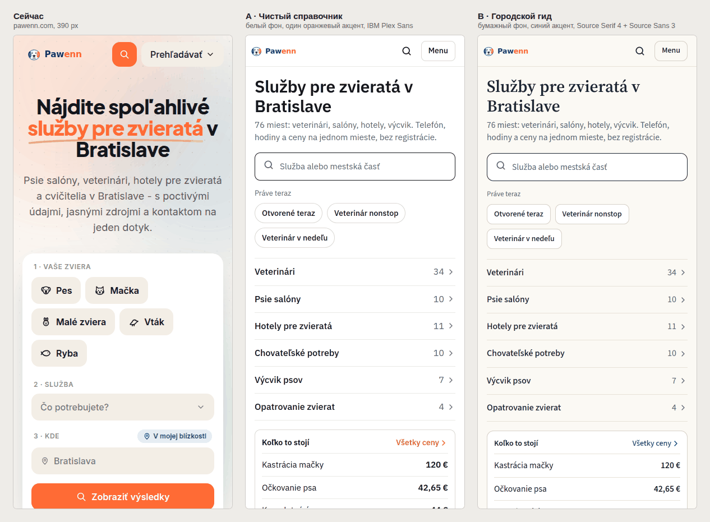

### Категория в городе

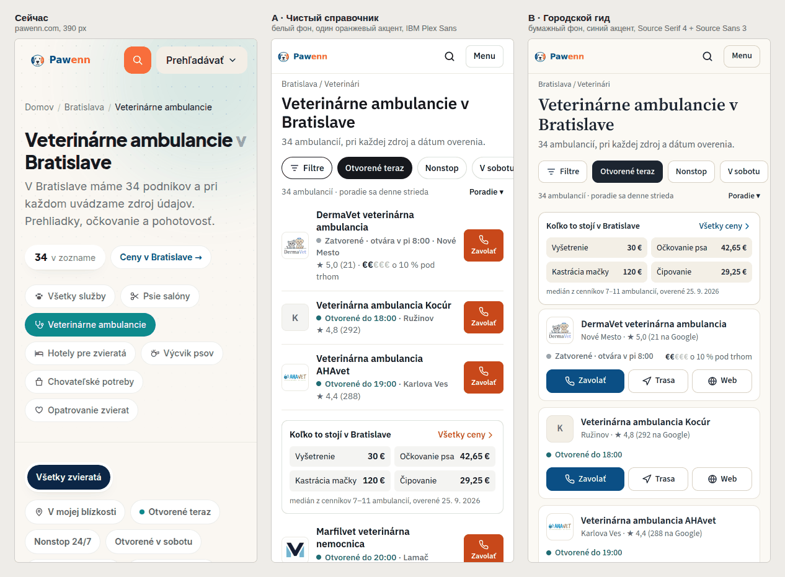

### Карточка места

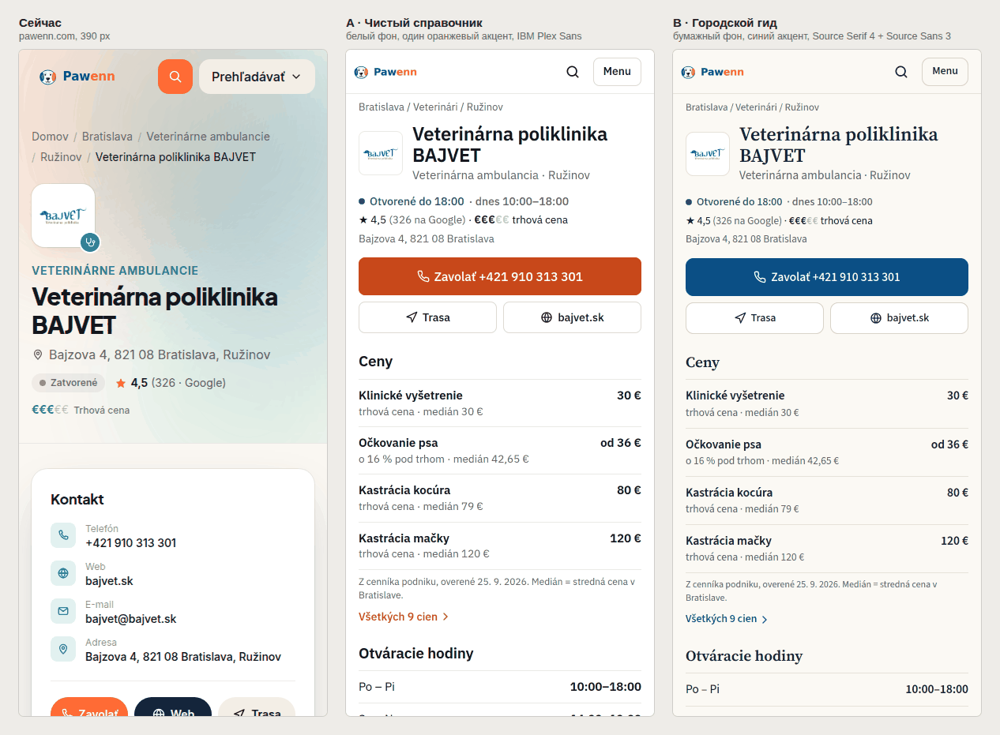

### A · «Чистый справочник»

Как хороший список в Google Maps: белый фон, строки через линии,
максимум мест на экран, одна кнопка «Zavolať» у каждого места.

| Токен | Значение |
|---|---|
| Фон / поверхность | `#FFFFFF` / `#F4F4F2` |
| Текст / вторичный | `#16181D` / `#5F636B` |
| Линии | `#EAEAE6`, `#D9D9D4` |
| Акцент (действие) | `#C8481A` — оранжевый логотипа, затемнённый до AA (4,78:1) |
| Открыто | `#1B7F4B` (5,0:1) |
| Шрифт | IBM Plex Sans 400/500/600 (заголовки и текст) |
| Радиусы | 8 / 10 px, фильтры — pill |

- \+ Плотность: строка ~100 px → ~8 мест на экран; первое место на
  261 px, первая «Zavolať» на 307 px (сейчас 1123 и 1304). Ближе всего
  к «справочнику».
- \+ Одна гарнитура вместо двух нынешних.
- \+ Сохраняет оранжевый цвет бренда.
- − Характера меньше: аккуратно, но безлико; оранжевая кнопка на каждой
  строке всё ещё «громкая».
- − «Web» и «Trasa» — только на странице места (+1 нажатие).

### B · «Городской гид» — рекомендую

Как печатный городской путеводитель, сделанный людьми: тёплый
бумажный фон, заголовки с засечками, спокойный синий из логотипа
(«Paw») для действий, у каждого места — «Zavolať / Trasa / Web» одной
строкой.

| Токен | Значение |
|---|---|
| Фон / поверхность | `#FBF9F4` / `#FFFFFF` |
| Текст / вторичный | `#1C2530` / `#5E6670` |
| Линии | `#E7E2D8`, `#D8D1C4` |
| Акцент (действие, ссылки) | `#0B4F85` — синий логотипа (8,5:1) |
| Открыто | `#1E7A4C` (5,1:1) |
| Шрифты | Source Serif 4 600 (заголовки) + Source Sans 3 400/500/600 (текст) |
| Радиусы | 10 / 12 px, фильтры 10 px |

- \+ **Свой характер** без эффектов: засечки в заголовках — самое
  дешёвое и сильное «не ИИ-шаблон», что можно сделать типографикой.
- \+ Синий — «надёжно», контраст с запасом; оранжевый остаётся в
  логотипе как акцент бренда, а не в каждой кнопке.
- \+ Сайт и маршрут — одно нажатие прямо из списка (бриф: «за 2–3
  действия до звонка, сайта или маршрута»).
- − Карточки выше строк A: ~150 px → ~5 мест на экран; первое место на
  435 px (над ним блок цен), первая «Zavolať» на 533 px — всё ещё на
  первом экране (сейчас 1304 px).
- − Две гарнитуры — столько же, сколько сейчас (Inter + Plus Jakarta
  Sans); обе с `latin-ext`, через `next/font`.

**Почему B.** Задача — «спокойный, надёжный местный справочник, который
сделали люди». A убирает шум, но остаётся нейтральным шаблоном; B
убирает тот же шум и добавляет голос — через типографику и тон, как
просит бриф («свой характер в мелочах, а не в эффектах»). Плотность B
всё равно вдвое выше текущей, а до звонка — в 2,5 раза ближе. Если нужна максимальная плотность —
можно взять B и строки из A (одна кнопка «Zavolať», Web/Trasa на
странице места).

### A, тёплая версия (по просьбе владельца, 2026-09-26)

Владелец попросил посмотреть A подробнее, но «приятно, а не просто
текст на белом фоне». Та же структура A (одна кнопка «Zavolať» у
места, всё главное на первом экране), но:

- фон тёплый `#F5F1EA`, места и разделы — белые карточки (радиус
  16–24 px, линия 1 px, без теней); главная начинается с мягкой
  персиковой шапки с логотипом-мордочкой;
- иконки категорий — в одном оттенке акцента, без шести цветов;
- цены — наглядно: шкала «от самого дешёвого до самого дорогого
  места» с медианой, в карточке места — где на ней это место;
- статус «Otvorené do …» — зелёная плашка, «Zatvorené» — серая;
- шрифт Figtree (дружелюбнее IBM Plex, с `latin-ext`), акцент
  `#B8431A` (белый текст 5,45:1); на холсте акцент можно переключить
  на синий или зелёный (Tweaks).

Холст с тремя экранами (главная → список → карточка, кликается):
приватный артефакт владельца «Pawenn — вариант A».

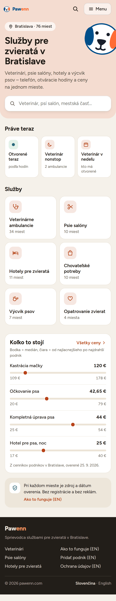
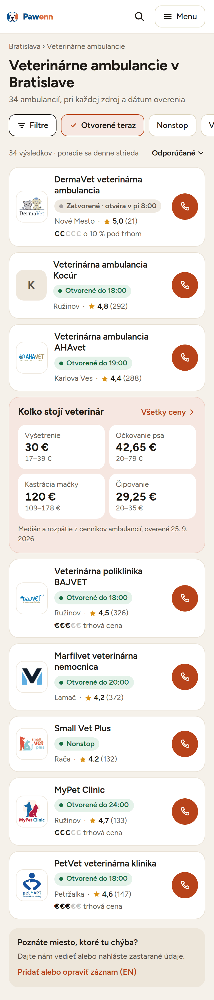
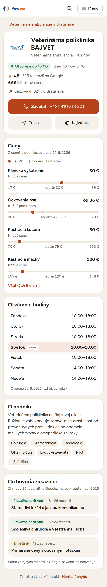

### Пять направлений «в духе» платформ (по просьбе владельца, 2026-09-26)

Владельцу нравятся Zocdoc и TripAdvisor; главная цель — уйти от
«ИИ-дизайна». Сделаны пять направлений, в каждом одни и те же три
экрана на одних и тех же реальных данных (главная, ветклиники в
Братиславе, карточка BAJVET), чтобы сравнивать только дизайн.
Узнаваемые приёмы платформ, но не копии: свои цвета, шрифты, без их
логотипов. Общее для всех: нет пятен, градиентов, «таблеток ради
таблеток», квиза и блока статистики; статус «открыто» в каждой
карточке списка; цены — заметный блок в списке; рейтинг всегда
подписан «на Google»; сводки отзывов — без кавычек, это пересказ, а не
цитаты.

1. **Как Zocdoc** — жёлтая шапка, крупный жирный DM Sans, часы работы
   «слотами» (сегодня / пятница / суббота), жёлтая кнопка «Zavolať»,
   в карточке — неделя сеткой из 7 дней.
   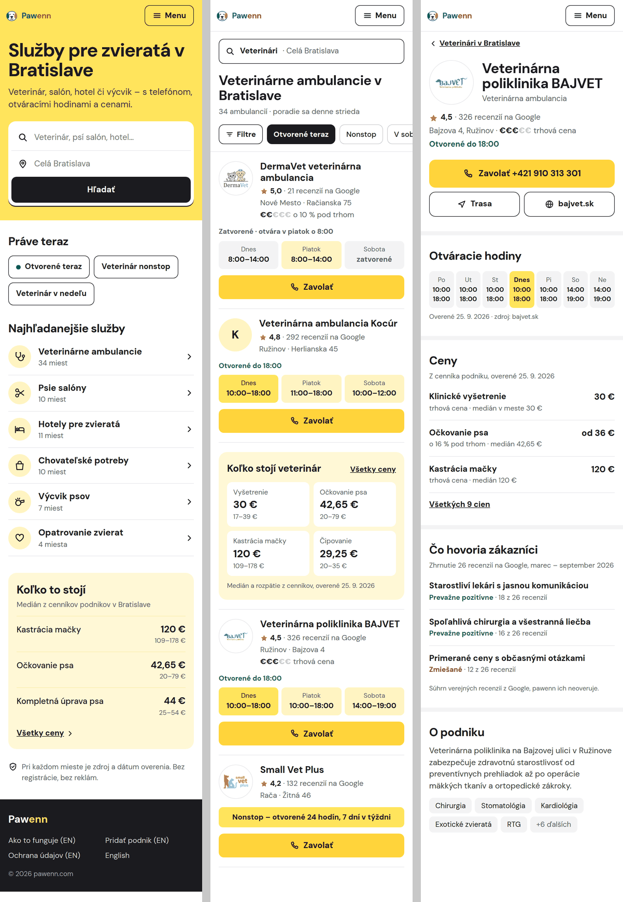
2. **Как TripAdvisor** — белый фон, чёрный жирный Archivo, рейтинг
   кружками, сводка отзывов прямо в карточке списка, чёрные кнопки-пилюли,
   в карточке места — вкладки и полосы «сколько отзывов про это».
   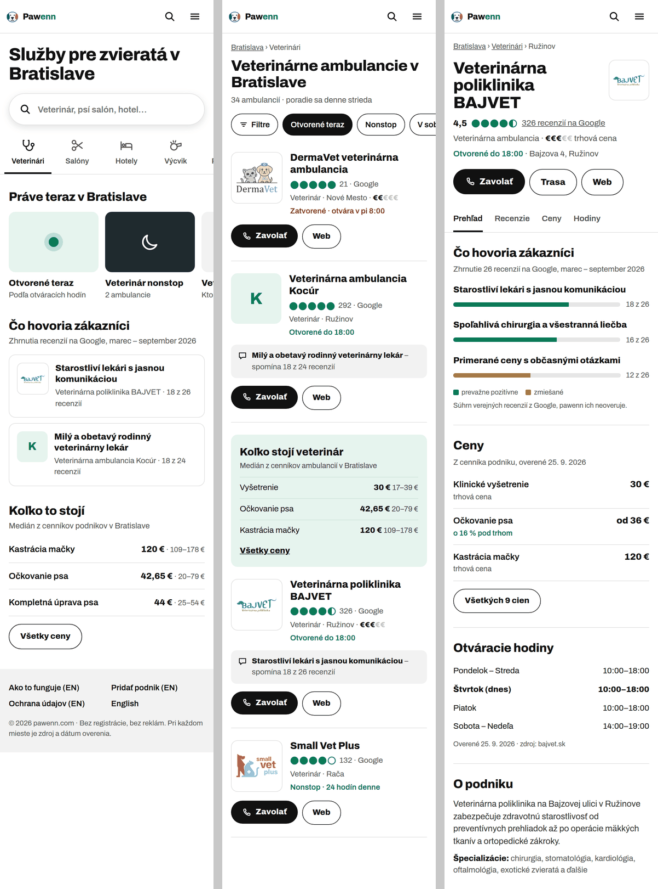
3. **Как Google Maps** — схема районов Братиславы из
   `data/cities/bratislava/districts.geojson` с реальными точками мест,
   поиск поверх карты, номера в списке = номера на карте, круглые
   кнопки действий, IBM Plex Sans. Карта рисуется из данных города —
   для нового города нужен только его geojson.
   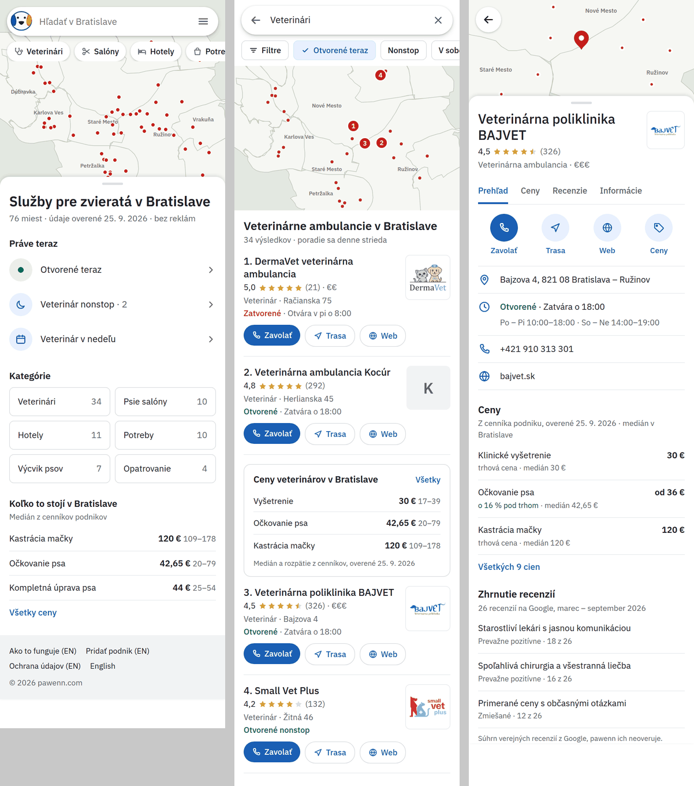
4. **Как Booking** — синяя шапка, поиск в жёлтой рамке, оценка в синем
   квадрате, «Zoradiť / Filtrovať / Mapa», таблица цен с синей шапкой,
   блок «Hlavné informácie», Source Sans 3.
   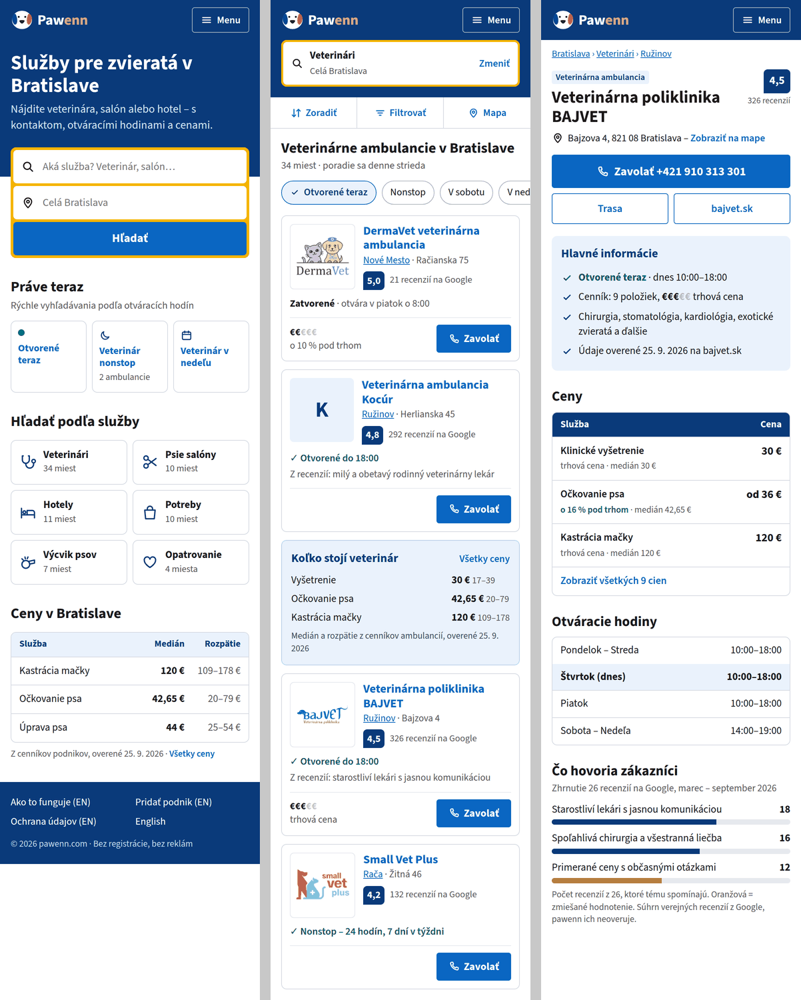
5. **Как Rover** (платформа именно для услуг для животных) — мягкий,
   дружелюбный: округлый Nunito, сливовый акцент, выбор услуги плитками,
   цена осмотра справа в карточке (где она есть в данных), круглые
   логотипы.
   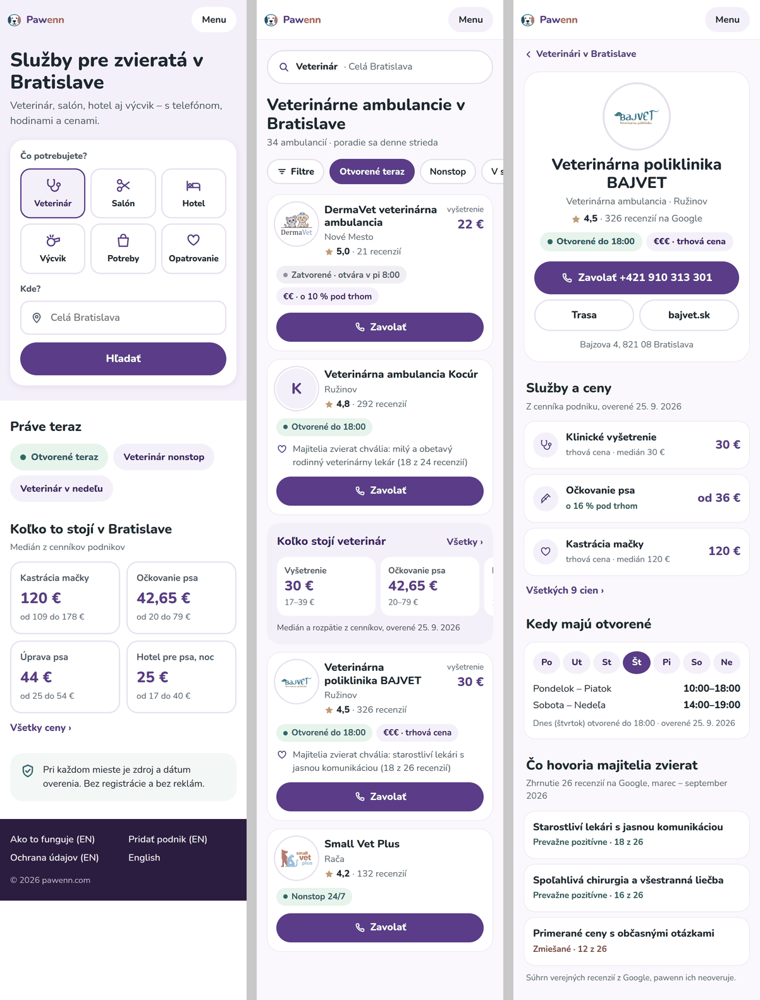

Все пять — на том же холсте, что и вариант A (ряды 1–5, A внизу).

---

## 6. План PR после согласования

По одному draft-PR за раз, в каждом — «было / стало» 390 и 1280, ссылка
на Vercel preview, что проверено; мерж только после вашего «одобряю».

1. **Токены и типографика** — `app/design-tokens.css`, шрифты в
   `app/[lang]/layout.tsx`, `app/globals.css`; `DESIGN.md` переписать
   под новую систему. Уже заметно везде (цвета, радиусы, тени, шрифты),
   без перестройки разметки: компоненты почти везде берут токены.
2. **Шапка и футер** — `Header`, `HeaderShell`, `MobileMenu`,
   `BrowseMenu`, `Footer`.
3. **Список и фильтры** — `CategoryListing`, `FilterPanel` (одна
   строка + нижний лист), `BusinessCard` (статус, одна строка действий),
   блок цен в списке.
4. **Карточка места** — `BusinessDetail`, `QuickActions`,
   `OpeningHoursTable`, `PriceTable`, `ReviewInsightsSection`; карта и
   отзывы — по вашим ответам (§7).
5. **Главная** — `app/[lang]/page.tsx`, `HomeSearch`; удалить
   `AmbientBackground`, `MythOrFact` и связанные тексты словарей.
6. **Цены, признаки, город** — `PricePages`, страница города
   (группировка по категориям).
7. **Служебные** — help, юридические, «добавить место», 404.

Проверка перед каждым показом: `npm run lint`, `npx next build`,
скриншоты обеих версий языка, длинные словацкие слова, пустые
состояния (фильтр без результатов; место без цен, часов, логотипа).

---

## 7. Нужно от владельца

1. **Направление: A или B** (или B со строками из A) — и правки, если
   что-то не так.
2. **Отзывы на карточке места.** Сейчас у всех 76 мест пустой блок
   «Zatiaľ bez recenzií» и форма. Предлагаю: блок показывать только
   когда есть отзывы, а форму — маленькой ссылкой «Napísať recenziu»
   внизу. Оставить как есть / так / убрать совсем?
3. **Карта Google на карточке места.** Предлагаю вместо встроенной
   карты — кнопку «Trasa» (уже есть) и статичный блок адреса; карту —
   только по нажатию «Zobraziť mapu». Меньше веса на телефоне, и
   cookies Google нет до клика. Юридическая сторона — ваше решение.

Остальное (что убрать с главной, фильтры, цвета категорий, тексты
интерфейса) — в рамках брифа, делаю как описано в §4, если не
возразите.
